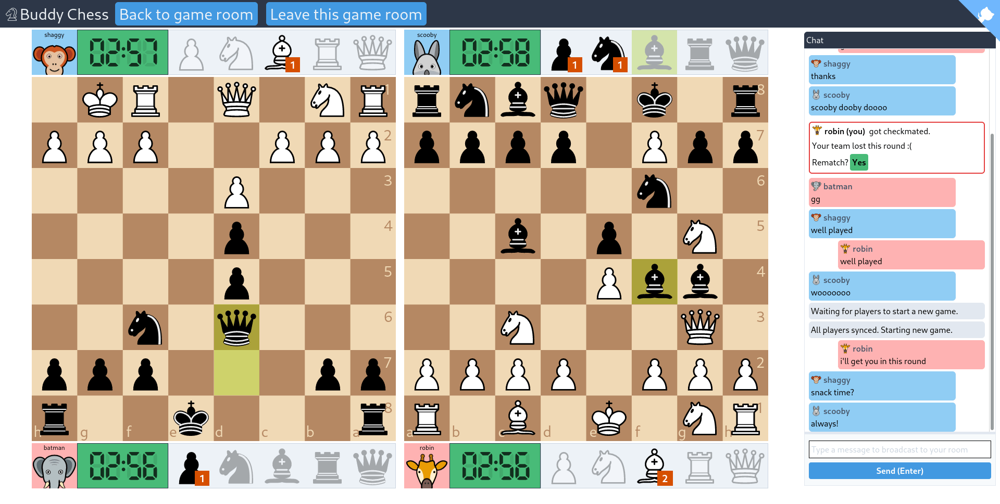
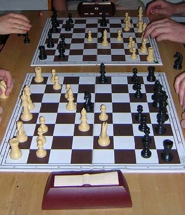
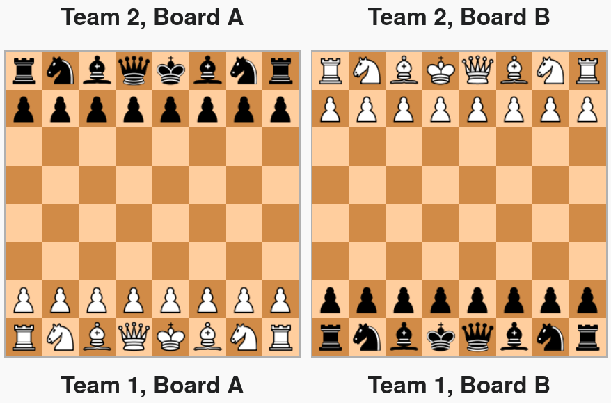

# Buddy Chess Utopia

## A friendly place for your bughouse chess needs

Live on: https://utopia.buddychess.com/

### What is this?

Buddy Chess Utopia is a place that lets you and your friends to get together and play some [Bughouse Chess](https://en.wikipedia.org/wiki/Bughouse_chess) online.

### What is Bughouse Chess?

Bughouse is the funnest of chess variations (citation not needed).

Breaking the solitary mold of chess, bughouse is a chess variation that let's you team up with a buddy for a fast paced chess game where you use your superior strategy and communication to slip through the cracks of opponents defenses.

### I'm sold. What are the rules? How is it played?

Bughouse is usually played in teams of two. In the seating layout, your team mate sits to your side and holds the same color pieces as your opponent.

Two main twists are introduced to the usual chess rules.

1. All pieces that you capture on your board will be passed to your team mate. You can think of it as these pieces go to your team mate's spare piece stash.
2. On your turn you can drop a piece from your spare stash on to your board (Pawns cannot be dropped on the first or last rank).

That's pretty much it. Read more thoroughly about Bughouse on [Wikipedia](https://en.wikipedia.org/wiki/Bughouse_chess).

### Why Buddy Chess Utopia?

- There is no logins, no accounts.
- You create a room, share the link and start playing.
- No central servers.

All the pros are its own cons. Choose responsibly.

### And what's with the Utopia?

There is no anti cheat mechanisms. We assume all players are good citizens in our utopia.

### How is it implemented?

The source of code this implementation is out in the wild: https://github.com/sransara/buddy-chess-utopia

Standing on the shoulders of giants:

- WebRTC : for P2P - https://github.com/feross/simple-peer
- Firebase : for discovery and signaling - https://firebase.google.com/
- Assymetric encryption for public communication - https://github.com/dchest/tweetnacl-js
- Chessboard - https://github.com/ornicar/chessground/
- Original chess rules - https://github.com/jhlywa/chess.js/
- Frontend - Svelte and Tailwind
